# ArgoCD GitOps Reconciliation Loop

ArgoCD continuously reconciles the `deploy` branch with live cluster state. The deploy workflow is the only writer to the `deploy` branch. Self-heal reverts manual `kubectl` changes. Prune deletes resources removed from Git. Replica counts are excluded from drift detection to allow manual scaling.

```mermaid
---
title: ArgoCD GitOps Reconciliation Loop
---
flowchart LR
    subgraph WF["deploy-platform.yml"]
        CH["Checkout main"]
        RES["Resolve placeholders<br/><small>sed: account-id, image-tag,<br/>rds-endpoint, acm-cert-arn,<br/>alb-sg-id, dbt-runner</small>"]
        PKG["Package projects<br/><small>dbt-project.tar.gz<br/>ge-project.tar.gz</small>"]
        FP["git push --force<br/>origin deploy<br/><small>commit: deploy: resolve<br/>production values [skip ci]</small>"]

        CH --> RES --> PKG --> FP
    end

    subgraph ARGO["ArgoCD — in-cluster controller"]
        POLL["Poll deploy branch<br/><small>~3 min interval</small>"]
        KBUILD["Kustomize build<br/><small>base + component + overlay<br/>→ resolved manifests</small>"]
        DIFF["Compute diff<br/><small>Git desired state<br/>vs cluster live state</small>"]
        SYNC["kubectl apply<br/><small>namespace: rideshare-prod<br/>CreateNamespace=true</small>"]
        RETRY["Retry on failure<br/><small>5 attempts, exponential backoff<br/>5s → 10s → 20s → 40s → 80s<br/>max 3 min</small>"]
    end

    subgraph CLUSTER["EKS Cluster — rideshare-prod"]
        LIVE["Live Resources<br/><small>Deployments, Services,<br/>ConfigMaps, Secrets...</small>"]
        HEAL["Self-Heal<br/><small>manual kubectl edit detected<br/>→ reverted to Git state</small>"]
        PRUNE["Prune<br/><small>resource deleted from Git<br/>→ deleted from cluster</small>"]
        IGNORE["ignoreDifferences<br/><small>Deployment/StatefulSet<br/>spec.replicas excluded<br/>(allows manual scaling)</small>"]
    end

    FP -->|"branch updated"| POLL
    POLL --> KBUILD --> DIFF
    DIFF -->|"changes found"| SYNC --> LIVE
    SYNC -->|"failure"| RETRY --> SYNC
    LIVE -->|"drift detected"| HEAL --> DIFF
    DIFF -->|"resource missing"| PRUNE
    IGNORE -.->|"skipped in<br/>diff check"| DIFF

    style WF fill:#e3f2fd,stroke:#1565c0
    style ARGO fill:#fff3e0,stroke:#e65100
    style CLUSTER fill:#e8f5e9,stroke:#2e7d32
```

