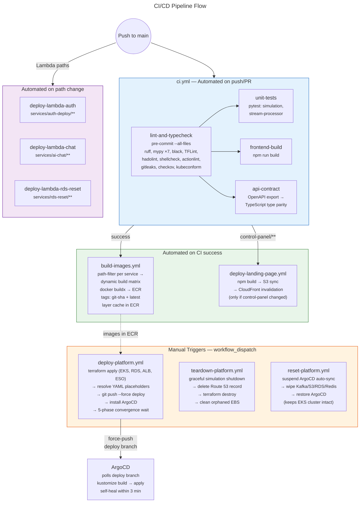

# CI/CD Pipeline Flow

The full path from code push to production deployment. Automated workflows trigger on push/CI success. Manual workflows handle platform lifecycle (deploy, teardown, reset). The `deploy` branch bridges Terraform-provisioned infrastructure with ArgoCD-managed workloads.

