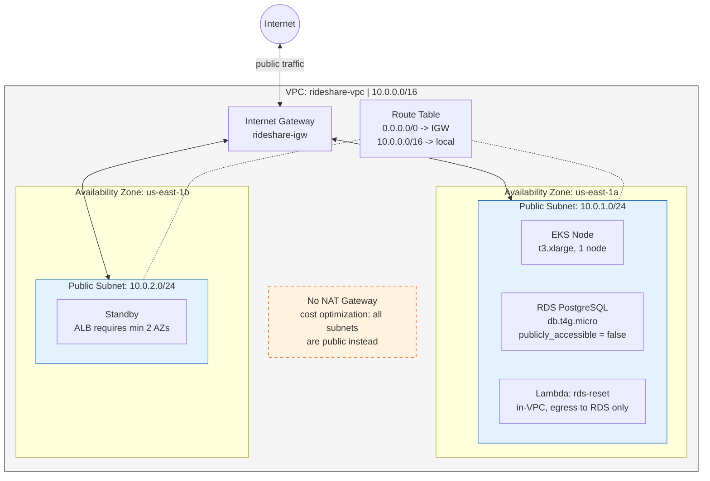
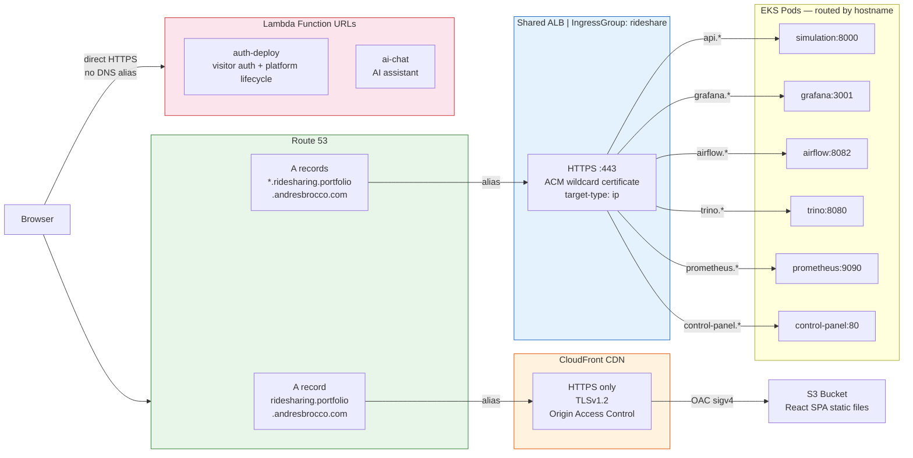
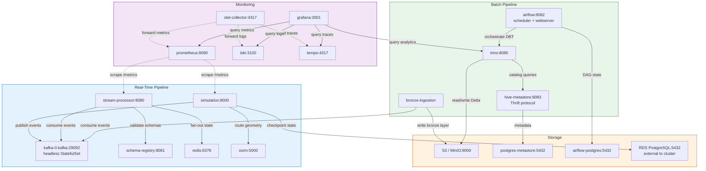
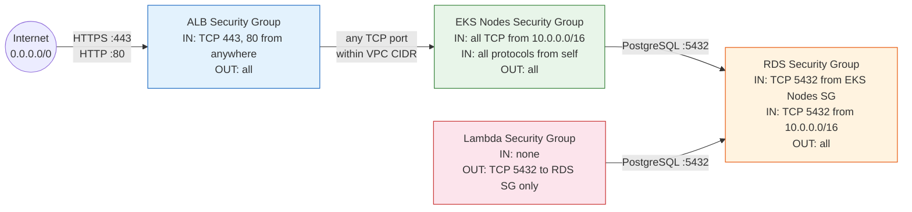
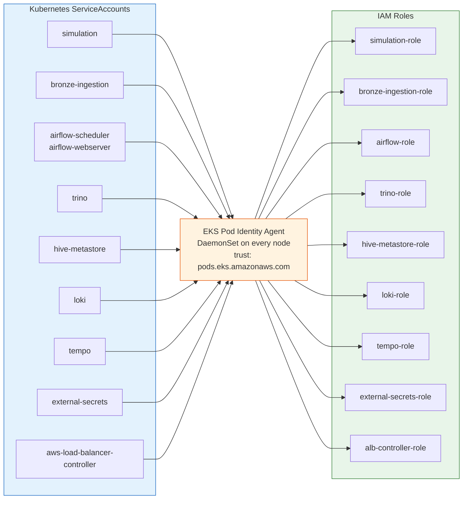

# Network Architecture Diagrams

Four diagrams covering the cloud networking layers of the rideshare simulation platform on AWS (EKS).

---

## 1. VPC & Network Topology

The physical network layout — what lives where. No data flow, just structure.

- **Public subnets only** — no private subnets or NAT Gateway (saves ~$32/month)
- **Two AZs** — required by ALB, provides basic fault tolerance
- **Single EKS node** — cost optimization for portfolio project (~$0.31/hr)

---

## 2. External Access, DNS & ALB Routing

How HTTP requests travel from a user's browser to backend services. Three distinct paths.

- **Apex domain** serves the React SPA via CloudFront + S3
- **Wildcard subdomains** route through a single shared ALB to EKS pods
- **Lambda Function URLs** are direct HTTPS endpoints (no ALB/DNS)

---

## 3. Kubernetes Internal Networking

Service-to-service communication inside the EKS cluster. All services use ClusterIP (internal only). DNS names follow the `service-name:port` convention. The VPC CNI plugin assigns each pod a real VPC IP address.

---

## 4. Security & IAM

Two layers of access control: **network perimeter** (Security Groups) and **credential injection** (Pod Identity).

### 4a. Security Group Chain

Each layer only allows traffic from the layer directly above it. The internet can only reach the ALB; the ALB can only reach EKS pods within the VPC; only EKS pods can reach RDS.

### 4b. Pod Identity Associations

Each Kubernetes ServiceAccount is mapped to an IAM role via EKS Pod Identity. Pods receive temporary AWS credentials automatically — no secrets in environment variables.

