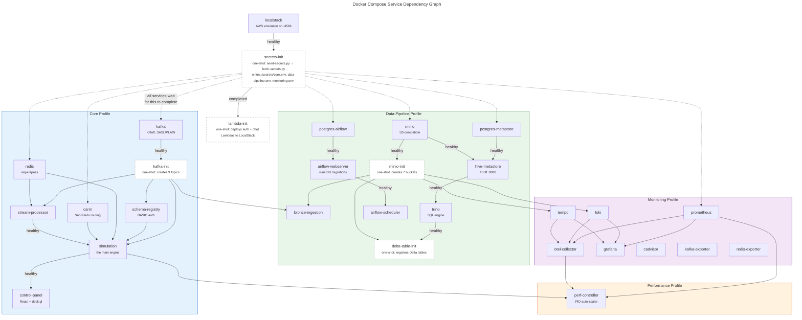

# Docker Compose Service Dependency Graph

Services organized by startup phase. Arrows represent `depends_on` blocking conditions (`healthy` or `completed_successfully`). Dashed borders indicate one-shot containers that run and exit. All services implicitly depend on `secrets-init` completing (shown via the dashed edge to each profile group).

