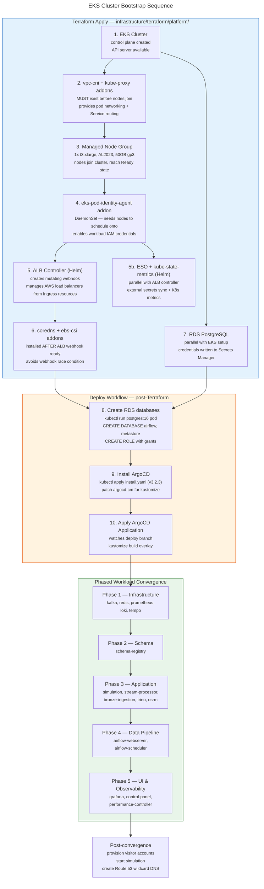

# EKS Cluster Bootstrap Sequence

Strict ordering constraints during cluster creation. Each step unlocks the next. vpc-cni must exist before nodes can reach `Ready`. The ALB controller's mutating webhook must be ready before coredns/ebs-csi addons install (otherwise the webhook rejects their pods). ArgoCD is installed last, after all cluster infrastructure is stable.

