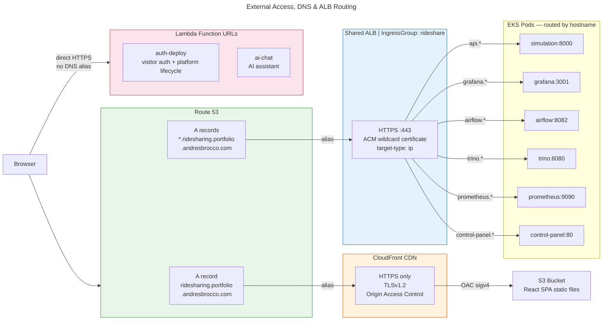

# External Access, DNS & ALB Routing

How HTTP requests travel from a user's browser to backend services. Three distinct paths.

- **Apex domain** serves the React SPA via CloudFront + S3
- **Wildcard subdomains** route through a single shared ALB to EKS pods
- **Lambda Function URLs** are direct HTTPS endpoints (no ALB/DNS)

