# IAM & Authentication Chains

Two distinct trust chains: GitHub Actions authenticates via OIDC federation (short-lived tokens, no stored credentials). EKS workloads authenticate via Pod Identity (the Pod Identity Agent DaemonSet intercepts SDK requests and vends temporary STS credentials).

```mermaid
---
title: IAM & Authentication Chains
---
flowchart LR
    subgraph GH["GitHub Actions — CI/CD Authentication"]
        RUNNER["GitHub Actions Runner<br/><small>runs workflow job</small>"]
        OIDC["GitHub OIDC Token<br/><small>signed JWT proving:<br/>repo, branch, workflow</small>"]
        STS_CI["AWS STS<br/><small>AssumeRoleWith<br/>WebIdentity</small>"]
        ROLE_CI["rideshare-github-actions<br/><small>IAM Role<br/>trust: token.actions.<br/>githubusercontent.com<br/>condition: main branch only</small>"]
        PERMS_CI["Permissions<br/><small>ECR push, EKS deploy,<br/>Terraform state, S3, RDS,<br/>Secrets Manager, Route 53,<br/>CloudFront, Lambda...</small>"]

        RUNNER -->|"1. request token"| OIDC
        OIDC -->|"2. present to AWS"| STS_CI
        STS_CI -->|"3. validate + assume"| ROLE_CI
        ROLE_CI -->|"4. temporary creds"| PERMS_CI
    end

    subgraph K8S["EKS — Workload Authentication"]
        POD["Pod<br/><small>ServiceAccount: simulation<br/>namespace: rideshare-prod</small>"]
        PIA["Pod Identity Agent<br/><small>DaemonSet on every node<br/>intercepts credential requests</small>"]
        STS_POD["AWS STS<br/><small>AssumeRole</small>"]
        ASSOC["Pod Identity Association<br/><small>Terraform resource binding:<br/>(cluster, namespace, SA) → role</small>"]
        ROLE_POD["rideshare-simulation<br/><small>IAM Role<br/>trust: pods.eks.amazonaws.com<br/>actions: AssumeRole, TagSession</small>"]
        PERMS_POD["Scoped Permissions<br/><small>e.g. simulation:<br/>S3 checkpoints R/W only<br/><br/>e.g. loki:<br/>S3 loki bucket R/W only</small>"]

        POD -->|"1. AWS SDK call"| PIA
        PIA -->|"2. lookup association"| ASSOC
        ASSOC -->|"3. resolve role"| STS_POD
        STS_POD -->|"4. assume role"| ROLE_POD
        ROLE_POD -->|"5. temporary creds"| PERMS_POD
    end

    style GH fill:#e3f2fd,stroke:#1565c0
    style K8S fill:#e8f5e9,stroke:#2e7d32
```

