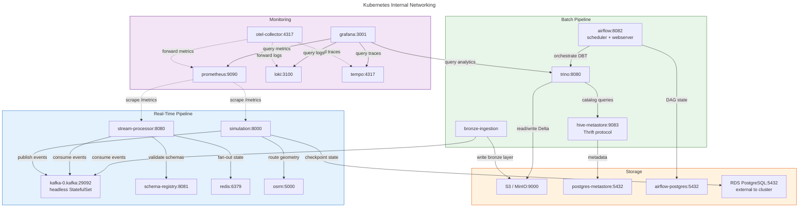

# Kubernetes Internal Networking

Service-to-service communication inside the EKS cluster. All services use ClusterIP (internal only). DNS names follow the `service-name:port` convention. The VPC CNI plugin assigns each pod a real VPC IP address.

