# Kubernetes Resource Topology

How Kubernetes resource types relate to each other within the cluster. Workload controllers create Pods. Pods consume ConfigMaps, Secrets, and storage. Services route traffic to Pods. Ingress/Gateway exposes Services externally.

```mermaid
---
title: Kubernetes Resource Topology
---
flowchart TB
    subgraph EXT["External Traffic"]
        GW["Gateway + HTTPRoute<br/><small>local: Envoy Gateway, path-based</small>"]
        ING["Ingress<br/><small>prod: 6 ALB rules, subdomain-based</small>"]
    end

    subgraph NS["Namespace: rideshare-prod"]
        subgraph WL["Workload Controllers → create Pods"]
            DEP["Deployments (17)<br/><small>simulation, stream-processor, redis,<br/>grafana, prometheus, minio, trino...</small>"]
            STS["StatefulSets (3)<br/><small>kafka (stable identity for KRaft),<br/>airflow-postgres, postgres-metastore</small>"]
            DS["DaemonSets (2)<br/><small>cadvisor (every node, reads Docker socket),<br/>otel-collector-logs (reads /var/log/pods)</small>"]
            CJ["CronJob (1)<br/><small>bronze-init: register Delta tables<br/>every 10min, concurrencyPolicy: Replace</small>"]
            JOB["Jobs (2)<br/><small>kafka-init, minio-init<br/>run-to-completion, no restart</small>"]
        end

        subgraph NET["Networking"]
            SVC["Services (ClusterIP)<br/><small>stable DNS name + IP<br/>load balances across pod replicas</small>"]
            HL["Headless Service<br/><small>kafka: clusterIP=None<br/>DNS resolves to pod IPs directly<br/>enables kafka-0.kafka:29092</small>"]
        end

        subgraph CFG["Configuration"]
            CM["ConfigMaps (12+)<br/><small>core-config, prometheus-config,<br/>grafana-dashboards-*, loki-config,<br/>otel-collector-config, airflow-dags...</small>"]
            SEC["Secrets (2)<br/><small>api-keys (API_KEY)<br/>app-credentials (14 keys)<br/>managed by ESO</small>"]
        end

        subgraph STR["Storage"]
            ED["emptyDir<br/><small>ephemeral, lost on pod restart<br/>used by most services</small>"]
            PVC["PersistentVolumeClaim<br/><small>kafka-data: 10Gi EBS gp3 (prod)<br/>survives pod restarts</small>"]
            HP["hostPath<br/><small>DaemonSets only:<br/>/var/log, /sys, /var/run/docker.sock</small>"]
        end

        PODS["Pods<br/><small>init containers (wait-for-X polls)<br/>→ main container</small>"]
    end

    subgraph ESO_NS["Namespace: external-secrets"]
        ESO["External Secrets Operator<br/><small>Helm chart v0.11.0</small>"]
    end

    GW --> SVC
    ING --> SVC
    DEP --> PODS
    STS --> PODS
    DS --> PODS
    CJ --> JOB
    JOB --> PODS
    SVC --> PODS
    HL --> PODS
    CM -->|"volumeMounts /<br/>envFrom"| PODS
    SEC -->|"env.valueFrom.<br/>secretKeyRef"| PODS
    ED --> PODS
    PVC --> PODS
    HP --> PODS
    ESO -->|"syncs AWS SM<br/>→ K8s Secrets"| SEC

    style EXT fill:#fce4ec,stroke:#c62828
    style NS fill:#f5f5f5,stroke:#424242
    style WL fill:#e3f2fd,stroke:#1565c0
    style NET fill:#e8f5e9,stroke:#2e7d32
    style CFG fill:#fff3e0,stroke:#e65100
    style STR fill:#f3e5f5,stroke:#6a1b9a
    style ESO_NS fill:#e0f2f1,stroke:#00695c
```

