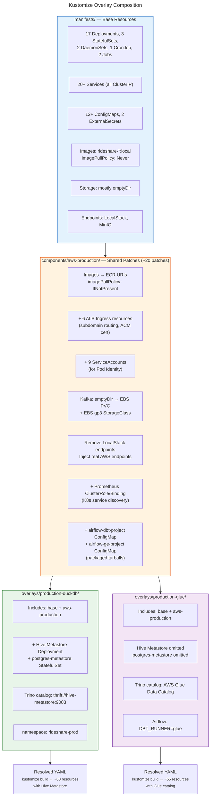

# Kustomize Overlay Composition

A template-free layering system. Base manifests define all resources with local-dev defaults. The shared `aws-production` component patches images, endpoints, storage, and adds production-only resources. Two mutually exclusive overlays select the Trino catalog backend (Hive Metastore vs AWS Glue).

