# Network Topology: Three Access Paths

Three different networking models depending on context. Docker Compose exposes services via host port mapping. Kind cluster uses Envoy Gateway with path-based routing. Production EKS uses an AWS ALB with subdomain-based routing.

```mermaid
---
title: "Network Topology: Three Access Paths"
---
flowchart TB
    subgraph DOCKER["Local: Docker Compose"]
        D_HOST["Host Machine<br/>localhost"]
        D_NET["Docker Bridge Network<br/><small>rideshare-network<br/>all services on same network</small>"]
        D_DNS["Service Discovery<br/><small>container name = DNS hostname<br/>kafka:29092, redis:6379,<br/>osrm:5000, minio:9000</small>"]
        D_PORTS["Host Port Mapping<br/><small>:8000 → simulation<br/>:5173 → control-panel<br/>:3001 → grafana<br/>:9092 → kafka<br/>:8082 → airflow<br/>:8084 → trino</small>"]

        D_HOST --> D_PORTS --> D_NET --> D_DNS
    end

    subgraph KIND["Local: Kind Cluster"]
        K_HOST["Host Machine<br/>localhost:80"]
        K_GW["Envoy Gateway<br/><small>GatewayClass: eg<br/>Gateway: rideshare-gateway</small>"]
        K_ROUTE["HTTPRoute Rules<br/><small>/api/* → simulation:8000<br/>/airflow/* → airflow:8082<br/>/grafana/* → grafana:3001<br/>/prometheus/* → prometheus:9090<br/>/trino/* → trino:8080<br/>/ → frontend:80</small>"]
        K_SVC["ClusterIP Services<br/><small>in-cluster DNS:<br/>simulation.default.svc:8000</small>"]

        K_HOST --> K_GW -->|"URLRewrite:<br/>strip path prefix"| K_ROUTE --> K_SVC
    end

    subgraph EKS["Production: AWS EKS"]
        P_DNS["Route 53<br/><small>*.ridesharing.portfolio<br/>.andresbrocco.com<br/>wildcard ALIAS → ALB</small>"]
        P_ALB["AWS ALB<br/><small>IngressGroup: rideshare<br/>(single ALB for all services)<br/>HTTPS :443 with ACM cert<br/>target-type: ip</small>"]
        P_ING["6 Ingress Resources<br/><small>api.* → simulation:8000<br/>control-panel.* → frontend:80<br/>grafana.* → grafana:3001<br/>airflow.* → airflow:8082<br/>trino.* → trino:8080<br/>prometheus.* → prometheus:9090</small>"]
        P_SVC["ClusterIP Services<br/><small>VPC CNI: real pod IPs<br/>simulation.rideshare-prod.svc:8000</small>"]

        P_DNS --> P_ALB --> P_ING --> P_SVC
    end

    style DOCKER fill:#e3f2fd,stroke:#1565c0
    style KIND fill:#f3e5f5,stroke:#6a1b9a
    style EKS fill:#e8f5e9,stroke:#2e7d32
```

