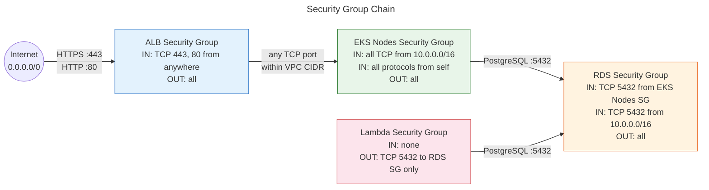
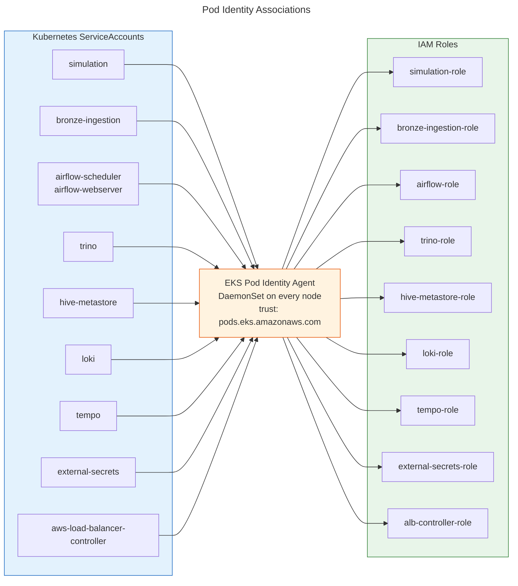

# Security & IAM

Two layers of access control: **network perimeter** (Security Groups) and **credential injection** (Pod Identity).

## Security Group Chain

Each layer only allows traffic from the layer directly above it. The internet can only reach the ALB; the ALB can only reach EKS pods within the VPC; only EKS pods can reach RDS.

## Pod Identity Associations

Each Kubernetes ServiceAccount is mapped to an IAM role via EKS Pod Identity. Pods receive temporary AWS credentials automatically — no secrets in environment variables.

