# Terraform Three-Layer Architecture

Infrastructure split into three workspaces with different lifecycles and costs. `bootstrap` runs once. `foundation` is long-lived and cheap. `platform` is ephemeral and expensive — created on deploy, destroyed on teardown. Outputs flow from foundation to platform via `terraform_remote_state`.

```mermaid
---
title: Terraform Three-Layer Architecture
---
flowchart TB
    subgraph BOOT["bootstrap/ — Run once, local state"]
        B_S3["aws_s3_bucket<br/>rideshare-tf-state-*<br/><small>versioning enabled,<br/>prevent_destroy</small>"]
    end

    subgraph FOUND["foundation/ — Long-lived, ~$8/month at rest"]
        F_VPC["VPC<br/><small>10.0.0.0/16, 2 public subnets,<br/>IGW, 3 security groups</small>"]
        F_IAM["IAM Roles<br/><small>CI OIDC role (GitHub Actions),<br/>EKS cluster/node roles,<br/>9 Pod Identity workload roles,<br/>Glue job role</small>"]
        F_S3["S3 Buckets (11)<br/><small>bronze, silver, gold, checkpoints,<br/>frontend, logs, loki, tempo,<br/>build-assets, ai-chat, tf-state</small>"]
        F_ECR["ECR Repos (8)<br/><small>one per service, scan-on-push,<br/>keep last 3 images</small>"]
        F_SEC["Secrets Manager (10)<br/><small>rideshare/*<br/>random passwords via<br/>hashicorp/random</small>"]
        F_DNS["Route 53 + ACM<br/><small>hosted zone + wildcard cert<br/>ACM forced to us-east-1</small>"]
        F_CF["CloudFront<br/><small>SPA distribution,<br/>Origin Access Control → S3</small>"]
        F_GLUE["Glue Catalog<br/><small>bronze, silver, gold DBs</small>"]
        F_LAM["Lambda Functions (3)<br/><small>auth-deploy, ai-chat, rds-reset</small>"]
        F_DDB["DynamoDB + KMS<br/><small>visitor tables, encrypted</small>"]
    end

    subgraph PLAT["platform/ — Ephemeral, ~$0.31/hour"]
        P_EKS["EKS Cluster<br/><small>v1.35, API auth mode,<br/>public endpoint only</small>"]
        P_NG["Node Group<br/><small>1x t3.xlarge, AL2023,<br/>50GB gp3, IMDSv2</small>"]
        P_ADD["EKS Add-ons (5)<br/><small>vpc-cni, kube-proxy, coredns,<br/>ebs-csi, pod-identity-agent</small>"]
        P_RDS["RDS PostgreSQL<br/><small>db.t4g.micro, v16.6,<br/>encrypted, 7-day backups</small>"]
        P_HELM["Helm Releases (3)<br/><small>ALB Controller, ESO,<br/>kube-state-metrics</small>"]
        P_PI["Pod Identity Associations (9)<br/><small>simulation, bronze-ingestion,<br/>airflow, trino, hive-metastore,<br/>loki, tempo, ESO, ALB controller</small>"]
    end

    BOOT -->|"creates state bucket<br/>used by both layers below"| FOUND

    FOUND -->|"terraform_remote_state<br/><small>vpc_id, subnet_ids, sg_ids,<br/>role_arns, secret_ids</small>"| PLAT

    style BOOT fill:#e8eaf6,stroke:#283593
    style FOUND fill:#e8f5e9,stroke:#2e7d32
    style PLAT fill:#fff3e0,stroke:#e65100
```

