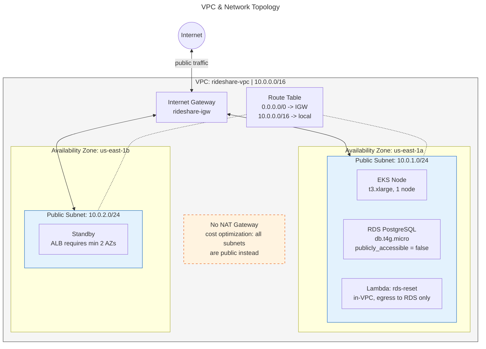

# VPC & Network Topology

The physical network layout — what lives where. No data flow, just structure.

- **Public subnets only** — no private subnets or NAT Gateway (saves ~$32/month)
- **Two AZs** — required by ALB, provides basic fault tolerance
- **Single EKS node** — cost optimization for portfolio project (~$0.31/hr)

