# Secrets Flow: Local vs Production

Two parallel paths to the same result: credentials injected into service environments. Local uses a shared Docker volume with `.env` files. Production uses External Secrets Operator syncing Kubernetes Secrets from AWS Secrets Manager.

```mermaid
---
title: "Secrets Flow: Local vs Production"
---
flowchart TB
    subgraph LOCAL["Local Development — Docker Compose"]
        direction LR
        LS2["LocalStack<br/>Secrets Manager<br/>emulation"]
        SEED["seed-secrets.py<br/>upserts 7 secret groups<br/>under rideshare/*<br/>default: admin/admin"]
        FETCH["fetch-secrets.py<br/>reads groups, applies<br/>key transformations:<br/>Airflow __, GF_ prefixes,<br/>bcrypt hash for Trino"]
        VOL[("secrets-volume<br/>/secrets/core.env<br/>/secrets/data-pipeline.env<br/>/secrets/monitoring.env")]
        ENT["Container entrypoint<br/>set -a<br/>. /secrets/core.env<br/>set +a<br/>exec app"]

        LS2 --> SEED --> FETCH --> VOL --> ENT
    end

    subgraph PROD["Production — EKS"]
        direction LR
        SM["AWS Secrets Manager<br/>rideshare/api-key<br/>rideshare/core<br/>rideshare/data-pipeline<br/>(real random passwords)"]
        SS["SecretStore CRD<br/>points ESO at<br/>AWS Secrets Manager<br/>(node role credentials)"]
        ES["ExternalSecret CRDs<br/>api-keys-sync → 1 key<br/>app-credentials-sync → 14 keys"]
        KS["Kubernetes Secrets<br/>api-keys<br/>app-credentials"]
        POD["Pod spec<br/>env:<br/>  - name: REDIS_PASSWORD<br/>    valueFrom:<br/>      secretKeyRef:<br/>        name: app-credentials<br/>        key: REDIS_PASSWORD"]

        SM --> SS --> ES --> KS --> POD
    end

    style LOCAL fill:#e3f2fd,stroke:#1565c0
    style PROD fill:#e8f5e9,stroke:#2e7d32
```

